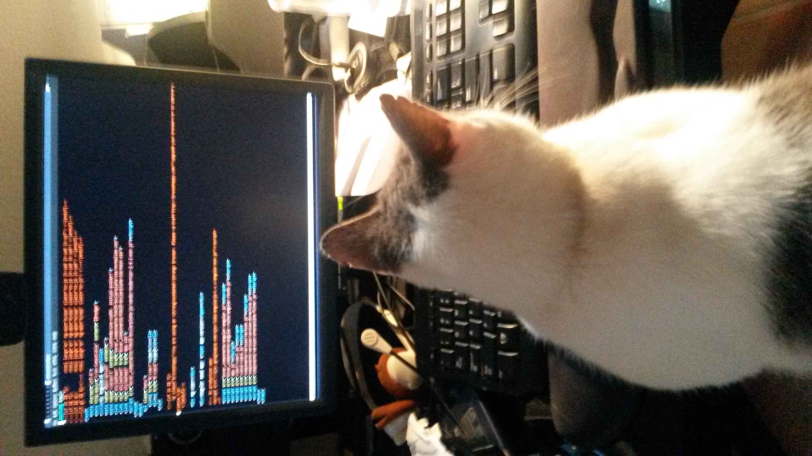

.. title: Angular Momentum
.. slug: angular-momentum
.. date: 2015-01-26 16:44:11 UTC
.. tags: javascript, angular, django
.. link: 
.. description: Getting angular working in django
.. type: text

On Friday I got to the point that the angular seed app is now checked
into my 80days repository.

Today's mission is to start turning that into the app I really want.

One of the first things I want to do is fix up angular so that it uses
different markers for its template substitution.

`Django`_ uses '{{' and '}}' to mark blocks that the template engine
needs to pay attention to and do substitutions.  Actually, the `django
template languate` has two escape patterns:

* {{ and }} are used to mark variables to be expanded

*  are used to mark django template tags.  These get used for
  things like marking *for* loops and the like

Now by an unhappy coincidence, `angular.js`_ also uses {{ and }} to
mark stuff for expansion.

Happily, angular allows you to over-ride these markers, as follows:

.. code-block:: javascript

   var my_app = angular.module('MyApp').config(function($interpolateProvider) {
       $interpolateProvider.startSymbol('{$');
       $interpolateProvider.endSymbol('$}');
   });

In fact, since I already had some code in my *app.js* I just added the
extra config code, so my *app.js* now looks like this:

.. code-block:: javascript

  'use strict';

  // Declare app level module which depends on views, and components
  angular.module('myApp', [
    'ngRoute',
    'myApp.view1',
    'myApp.view2',
    'myApp.version'
  ]).
  config(['$routeProvider', function($routeProvider) {
    $routeProvider.otherwise({redirectTo: '/view1'});
  }]).

  config(function($interpolateProvider) {
      $interpolateProvider.startSymbol('{$');
      $interpolateProvider.endSymbol('$}');
  });

So, making some progress, but I still can't figure out this controller
thing and how to tie it all together.  Time to go back to
`codeschool`_.

In particular, their `shaping up with angular`_ introduction.  I had
to register with codeschool.  Thankfully, that was painless bar having
to create yet-another-password. 

But it has been worth it.  You can watch the videos at 1.5x or 2.0x or
slow them down.  It would be great if they took the mythtv trick and
shifted the frequency of voices down so that the presenters don't
sound like chipmunks on speed when you speed things up.

The good bit is you can click on "Start Challenges" as soon as you are
bored with the video.  

Once in the challenges, the "check my work" button is genius and
extraordinarily helpful.

Angular date filter
===================

I just fell in love with the angular date filter.  Feed it a unix
datetime and it does the right thing.  Eg Unix time began 1969/12/31 @
8:00PM in Bermuda, note the four our offset from UTC.

See this `github commit`_ for some code.

Thanks
======

Thanks to @ergoemacs on twitter who posted a link to their excellent
mini tutorial on `magit-mode`_: git mode for emacs.  I had this
installed already, but never quite plucked up the courage to try it.
Wow: git in emacs: lovely jubbly!

And thanks to stack exchange for this tip on how to `diff a single
file with magit`_,  Answer: just hit tab in the magit status buffer on
the line for the file you want to diff.  More `lovely-jubbly`_.

And finally, thanks to Snowy, who helped with the coding:

.. _django template languate: https://docs.djangoproject.com/en/1.7/topics/templates/

.. _diff a single file with magit: http://stackoverflow.com/questions/17798109/how-can-i-diff-a-single-file-with-magit

.. _lovely-jubbly: http://www.urbandictionary.com/define.php?term=lovely+jubbly

.. _shaping up with angular: http://campus.codeschool.com/courses/shaping-up-with-angular-js

.. _github commit: https://github.com/swfiua/80days/commit/04a9b8a64f9cb402c434ad1f6b6224757ca09182

.. include:: posts/references.rst
