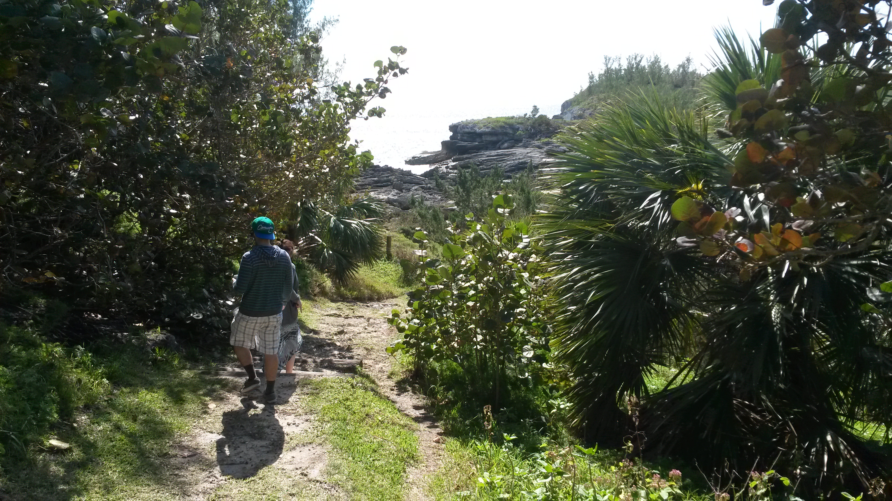
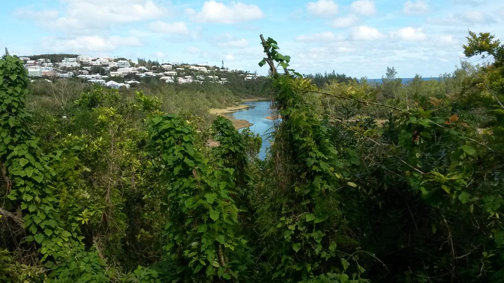
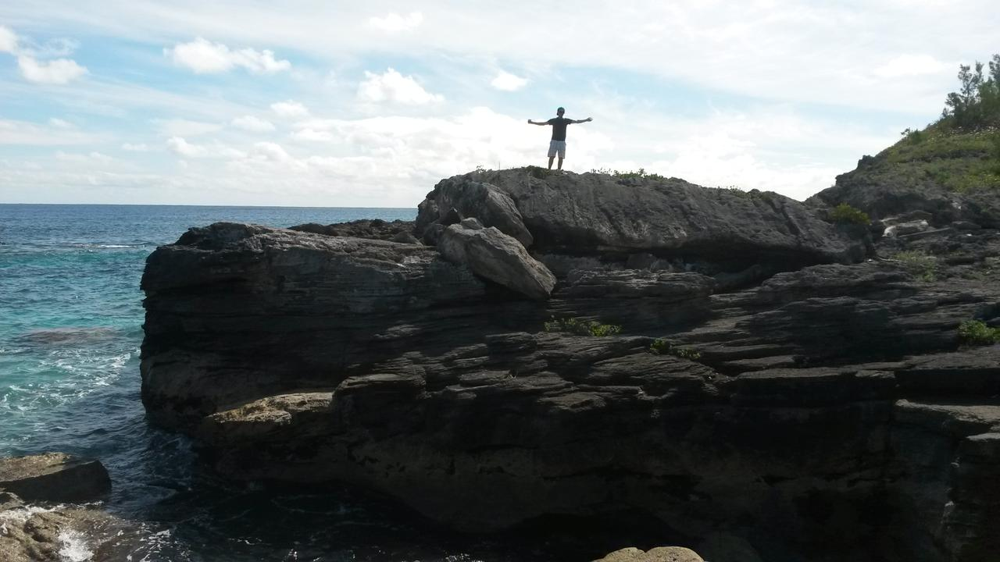

.. title: Bermudaful Day
.. slug: bermudaful-day
.. date: 2015-03-10 03:35:22 UTC
.. tags: bermuda, gardening, Spittal Pond
.. link: bermuda gardening spittalpond
.. description: A lovely day in Bermuda
.. type: text

A couple of weeks back I had my sons and their partners visiting from
Canada.  They were having difficulty understanding why I am thinking
it was so cold here.  

I've lived in many places, but including hard Ottawa winters, but
never felt as cold as Bermuda the last few weeks.  It is all
perspective. 

We had good times while they were here, below is just one of those
days. 

Pink and blue limo
==================

We'd decided to go to Spittal Pond.  As we are down the west end of
the island, that means 2 buses, or `the pink and blue limo`_.

We were in luck, the number 7 bus pulled up just as we reached the
stop.  A sunny day, so the views along South Shore were spectacular.

We were soon in town and just had a bit of time between buses to look
at Victoria Park and the web of ropes holding up trees that have been
lifted back up since the hurricanes knocked them over.  

Onto the number 1 bus and another beautiful journey.  You are higher
up on the bus, and see so a lot more.  Plus it stops every now and
again.  

Spittal Pond
============

I have liked Spittal Pond for a lot of years.  It is a place in
Bermuda where you can really feel in a natural environment.
Spectactular views and lots to explore.  

It is also a place that changes through the seasons, so there is
always something new to see. 

This was the first time I had been since the hurricanes.  There wasn't
much sign of them on this walk.  Just a fiew views that didn't used to
exist. 

But we were treated to a sunny day without much wind.  The ocean
always looks better in the sun.  It lights up the clarity of the water
and the pink sand beneath.

The path leads down to some rocks where in a few places there are
actually steps cut out to make it a little easier to clamber over.  

At the waters edge there were a couple of large parrot fish, bobbing
around as the waves were breaking against the rocks.

Portuguese Rock
=============== 

We took the little detour up to a rocky cliff overlooking the ocean.
Here there is a brass plate that is a cast of an inscription that was
found on the rock here.  It has the date 1543 and some other marks
that have been interpretted as "R. P." standing for Rex Portugaline.

1543 is nearly 70 years before the island was settled, indicating that
there is more to the early history of this island than we are every
likely to discover.

The farm on McGalls Hill
========================

Once back at the road we decided to walk over the hill, past St Mark's
church and down McGall's Hill to the Northrock.

Part way down the hill we stopped to look at a small banana
plantation.  The farmer, Henry, and his wife, Theresa, were there
looking after the land and invited us down.

Henry delighted in telling us just what is invoved in growing
bananas.  He also showed us onions, giant cloves of garlic and new
potatoes. 

They had such patience in showing how all the different plants
thrived.  Henry also told us about the fruit salad tree.  

Citrus fruit used to be a big thing in Bermuda.  If you visit the
island ask an older Bermudian about the citrus and they will tell you
Bermuda used to have some of the best citrus fruit you can find.

Henry explained that you can even grow fruit salad trees here: a
single tree that grows lemons, limes, oranges and grapefruit, all as a
result of grafting buts from different fruits onto a wild lemon base.

All in all, it was a great day.

.. _Spittal Pond: http://en.wikipedia.org/wiki/Spittal_Pond_Nature_Reserve
.. _the pink and blue limo: the-pink-and-blue-limo.rst
