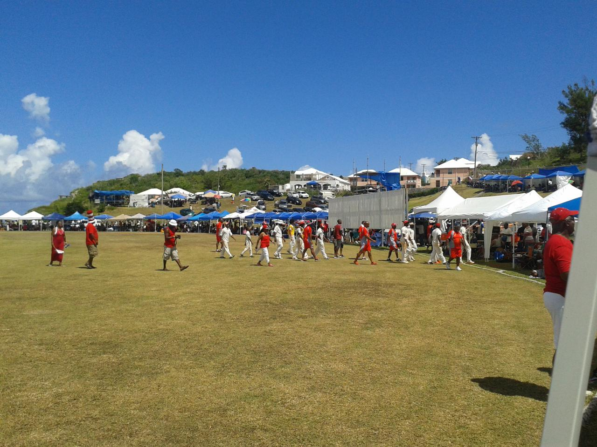

.. title: Red and White v Blue and White
.. slug: red-and-white-v-blue-and-white
.. date: 2015-07-20 00:35:52 UTC
.. tags: 
.. category: bermuda, cricket, blades
.. link: 
.. description: A day at Lord's
.. type: text

Last Saturday there was a big cricket match at Lord's.

Not the Lord's where England were falling apart as the Aussies were
dominating the second test, but Lord's in St David's, Bermuda.

Bailey's Bay were playing Cleveland County in what is known as the
Eastern Counties.

Each team in Bermuda has its colours, Bay are red and white, Cleveland
are blue and white.

I come from Sheffield, UK, a city divided between the blue and white
of the Owls and the red and white of the Mighty Blades.  I follow the
Blades, so it was natural for me to be cheering for Bailey's Bay.

We had a slow start to the day and it was a long (for Bermuda) ride on
the moped to St David's, so we didn't get to the ground until just
before lunch.

As we entered we were greeted by a larger than life character in red
and white.  Once I took out my red and white, *cat in the hat*
headgear he directed us towards the Digicel tent.

The game was nicely poised, with Cleveland batting first and on about
80 runs for 4 wickets at lunch.

After lunch the Bay bowlers dominated and Cleveland were bowled out
for 127 in 49.3 overs.

           

Lord's is a wonderful ground, right by the ocean, with natural banks
on which people build stands.  Between innings we went for a walk
round the ground and took some pictures.

.. image:: ../galleries/EasternCounties/20150718_125203.jpg
   :width:  400
   :height: 300

And then there is the precariously perched commentary position that
you have to walk the plank to get to:
           	   
.. image:: ../galleries/EasternCounties/20150718_152446.jpg
   :width:  400
   :height: 300

Now being a Blades supporter I have got used to my team snatching
defeat from the jaws of victory.  The target of 128 that Bay were set
should have been easily within their grasp, but we were about to
witness one of the most bizarre afternoon's cricket there ever was.

Bay lost two early wickets, but then regrouped and the batsmen were
starting to open up at 50-2.   Cleveland had a couple of strong
appeals turned down.  There was a strong appeal for a catch, but it
was one of those where it was hard to tell if the ball had been
blocked into the ground or hit the ground and come off the bat.  The
umpire gave the benefit of the doubt to the batsman.

Cleveland protested and for 40 minutes chaos ensued.  Both coaches,
the president of the Eastern Counties and even a policeman took to the
pitch to try and get the game restarted.

.. image:: ../galleries/EasternCounties/20150718_171958.jpg
   :width:  400
   :height: 300

Soon after the restart, there was another delay for a drinks break.
The batsmen were finding it difficult to get into any sort of rhythm
and first ball after the break a wicket fell.

After this wickets fell steadily, but Bay always looked like they
would make it.  Until, after 30 overs, with the scores tied and Bay
with just 2 wickets remaining the umpires declared the game over.

With the scores tied, Cleveland, as holders, were declared winners.

It reminded me of the infamous F.A. Cup tie when the Blades were
holding their own against an Arsenal side.  The ball was kicked into
play for an injury.  The resulting throw was sportingly thrown back to
the blades players, but Kanu did not seem to understand what was
happening, raced onto the ball and slotted it into the net.

Arsenal went on to win, but Wenger graciously agreed to replay the
game.  Of course, the Blades went on to lose the replay, but at least
the game was not decided by this bizarre incident.

I read today that the Cleveland coach was very unhappy with his sides
behaviour, perhaps he will follow Wenger's example and ask for the
game to be replayed.  However, that might not be possible given the
busy summer cricket schedule here in Bermuda, with Cup Match [#1]_ less than
two weeks away this might not be an option.

Today's Royal Gazette has a full page `editorial`_ on the game.  There
are also rumours that Cleveland have been `stripped of the cup`_.

It is never dull following the Red and White wizards.

So much for the cricket, the day itself was fun from beginning to
end.  Unfortunately, I had packed the bag of stuff to take to the
ground, so instead of drinks and food and sunscreen we had an
assortment of raspberry pi's, humidity sensors, air pressure sensors,
wires, breadboards and a netbook.

There was food in the clubhouse, yellow and blue, St David's colours.
So we were able to find some chips that weren't made of silicon.  And
the rum swizzle went down very smoothly.

The banter in the crowd rarely stopped, with fans from both sides
sitting enjoying together.

Cricket in Bermuda is very much something you go to watch with family
and friends.  Worst case, you have a day in the sunshine in a
beautiful setting, with people you love.

Next stop the blue and red of Somerset playing the light and dark blue
of St George's.  Cup Match!

.. _editorial: http://www.royalgazette.com/article/20150720/COMMENT01/150729969

.. _stripped of the cup: http://www.royalgazette.com/article/20150720/SPORT02/150729960   

.. [#1] Cup match is a two day game between the Red and Blue of
        Somerset and the dark and light blue of St Georges.  
